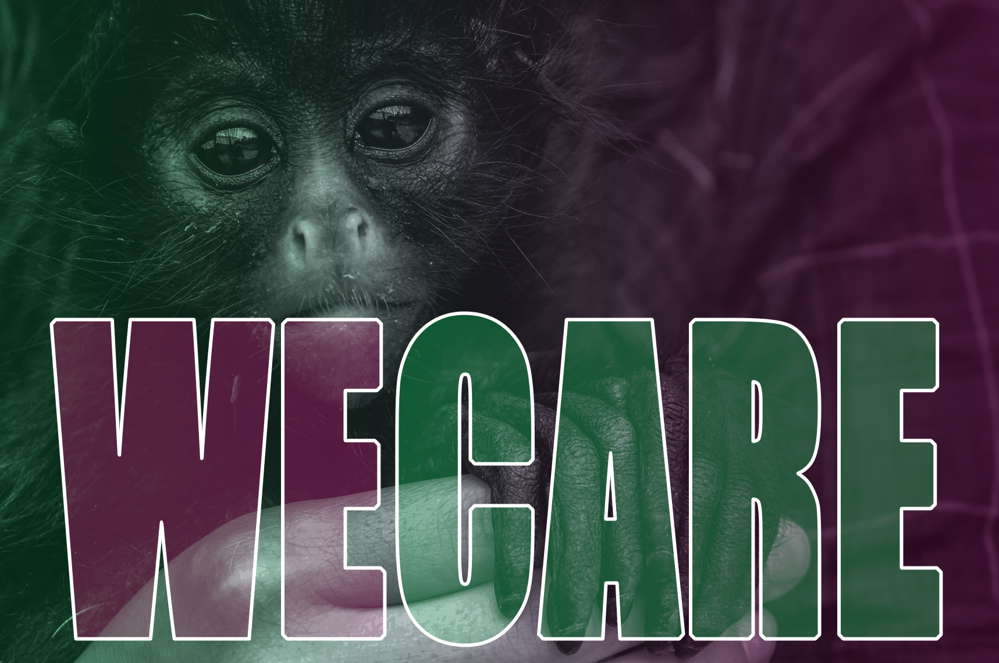

# WeCare - Project



## Apresentação
A API WeCare foi inspirada pelo curta-metragem [_Save Ralph_](https://www.youtube.com/watch?v=G393z8s8nFY), sobre a situação de animais que são usados como cobaia para testes. O projeto visa a criação de uma plataforma onde o usuário/consumidor pode pesquisar sobre empresas _Cruelty Free_, aquelas que não fazem uso de animais para os testes de seus produtos. O usuário poderá visualizar as empresas já cadastradas e também inserir novos dados/empresas, que ainda não se encontram na plataforma. 


<br></br>

## Sumário
=================
<!--ts-->
   * [Funcionalidades](#funcionalidades)
   * [Instalação](#instalação)
   * [Arquitetura Model View Controller](#arquitetura)
   * [Tecnologias](#tecnologias)
   * [Rotas](#rotas)
   * [Modelo com campos obrigatórios para teste: Postman ou Insomnia](#modelo-para-testes)
   * [Agradecimentos](#agradecimentos)
<!--te-->


## Funcionalidades

- Exibe marcas cadastradas
- Cadastro de novas marcas
- Atualiza dados
- Filtra por país de origem categoria. (Exemplo: Maquiagem, produtos de limpeza, produtos de higiene)
- Função de like e unlike
- Adiciona review sobre as marcas


## Instalação

## ⚙️ Como rodar o projeto
```bash
# Com o git
# Clone este repositório
$ git clone https://github.com/yaralviana/WeCare
# Acesse a pasta do projeto no terminal/cmd
$ cd wecare
# Instale as dependências
$ npm i
$ npm i mongoose
# Execute o servidor
$ npm start
# O servidor inciará na porta:3000 - acesse <http://localhost:3000>
```
* Modifique `.env` para receber as variáveis de ambiente e substitua para que seu servidor funcione adequadamente

Para acessar via Heroku, acesse o [link da API](https://wecare-project.herokuapp.com/)

##

 MONGODB_URL = URL do `MongoDb Atlas` Banco de dados orientado a documentos e interface na nuvem.
    
<br>


## Arquitetura

        Arquitetura MVC
        |
        \--📂  WeCare
            |   README.md  
            |   .env
            |   .gitignore
            |   package-lock.json
            |   package.json
            |   server.js
            \--📂 node_modules
            \--📂 assets
            \--📂src
                |
                | app.js
                |
                📂---controller
                |       brandsController.js
                |       reviewController.js
                |
                📂---database
                |       mongoConfig.js
                |                    
                📂---models                       
                |       brandsSchema.js
                |       reviewSchema.js
                |       
                |
                📂---routes
                |       brandsRoutes.js
                |       reviewRoutes.js 


## Tecnologias
- [JavaScript](https://www.javascript.com/)
- [Git/Github](https://github.com/)
- [Node.js](https://nodejs.org/en/)
- [MongoDb](https://www.mongodb.com/)
- [MongoCompass](https://www.mongodb.com/pt-br/products/compass)
- [MongoDBatlas](https://www.mongodb.com/cloud/atlas)
- [Postman](https://www.postman.com/)
- [VScode](https://code.visualstudio.com/)
- [heroku](https://dashboard.heroku.com/apps)  

### Pacotes Utilizados 

- [Express](https://expressjs.com/pt-br/)
- [Nodemon](https://nodemon.io/)
- [dotenv](https://www.npmjs.com/package/dotenv)
- [Mongoose](https://mongoosejs.com/)
- [cors](https://www.npmjs.com/package/cors)
- [modemon](https://www.npmjs.com/package/nodemon)


<br>

## Rotas

* local: http://localhost:3000

* Heroku: https://wecare-project.herokuapp.com/

    * Utilize o [Postman](https://www.postman.com/) ou [Insomnia](https://insomnia.rest/download/) para testar os endpoints da API localmente ou via Heroku

<br>


| Método HTTP  | Endpoint                     | Descrição                            |
| ------------ | ---------------------------- | ------------------------------------ |
| GET          | `http://localhost:3000/`     |  Mensagem de boas vindas    |             |

<br>

## Manipulação das rotas

| Método HTTP  | Endpoint                | Descrição                            |
| ------------ | ----------------------- | ------------------------------------ |
| GET          | `/brands`              | Retorna todas as marcas             | 
| GET          | `/brands/:id`          | Retorna marca por id      |
| POST         | `/brands/create`    | Cria/cadastra nova marca          |
| PUT          | `/brands/:id/update`          | Altera informações de uma marca       |
| DELETE        | `/brands/:id/delete`          | Remove uma marca           |
| PATCH        | `/brands/:id/like`          | Adiciona like na marca           |
| PATCH        | `/brands/:id/unlike`          | Retira like na marca           |
| POST         | `/brands/:id/reviews`    | Adiciona comentário sobre a marca          |
| GET         | `/brands/:id/reviews`    | Exibe comentários sobre a marca          |


## Modelo para testes
    {
                "name": "artnaturals",
                "category": ["higiene pessoal", "aromaterapia"],
                "country": "eua"
    }

Deve retornar:

    {
        "_id": "61bccc6ce6a3b54c5dede488",
        "name": "artnaturals",
        "category": [
            "higiene pessoal",
            "aromaterapia"
        ],
        "country": "eua",
        "likes": 0,
        "submitted": "2021-12-17T17:43:20.746Z",
        "__v": 0
    }
<br>

## Reviews
        {
            "review": "Ótimos produtos. Recomendo."
        }

Deve retornar: 

        [
            {
                "_id": "61bcccc7e6a3b54c5dede48d",
                "review": "Ótimos produtos. Recomendo.",
                "submitted": "2021-12-17T17:43:20.756Z",
                "__v": 0
            }
        ]
## Agradecimentos

Agradeço a equipe {reprograma} por me dar a oportunidade de fazer parte de um projeto tão incrível com pessoas maravilhosas. Às minhas professoras do projeto, pela orientação exemplar e pelos conhecimentos passados, além de toda a compreensão e paciência demonstradas ao longo das aulas.
<br>
Agradeço ao meu namorado, Jardel, por todo o apoio e por ser uma pessoa tão especial em minha vida. Aos meus pais, Maria de Lourdes e Francisco por todo o suporte emocional e por sempre me apoiarem nos meus desafios. E aos meus amigos desenvolvedores que se disponibilizam a tirar minhas dúvidas sempre que possível. 
<br>
E por último, e não menos importante, agradeço também às minhas colegas de turma da TodasEmTech14 que são sempre muito solícitas e gentis umas com as outras. 💜
<br>

## Feedback e sugestões
Estou aberta à criticas e sugestões sobre o projeto. Sinta-se livre para entrar em contato comigo: 

- [@yaralviana](https://www.github.com/yaralviana)
- [LinkedIn](https://www.linkedin.com/in/yaralviana/)
- [E-mail](mailto:yaralviana@gmail.com)


